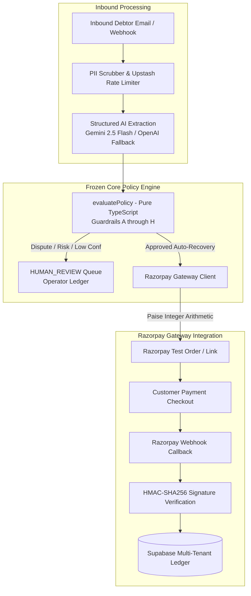
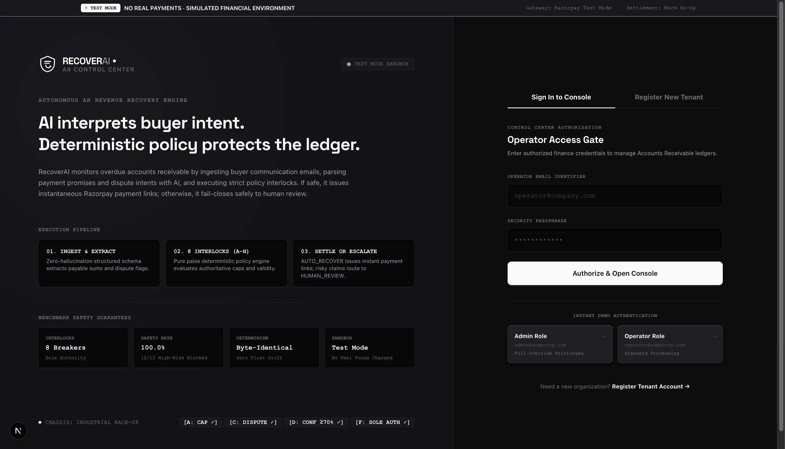
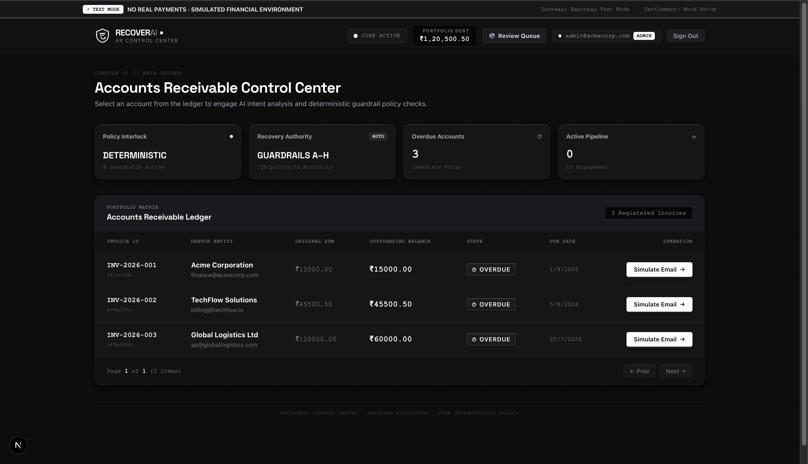
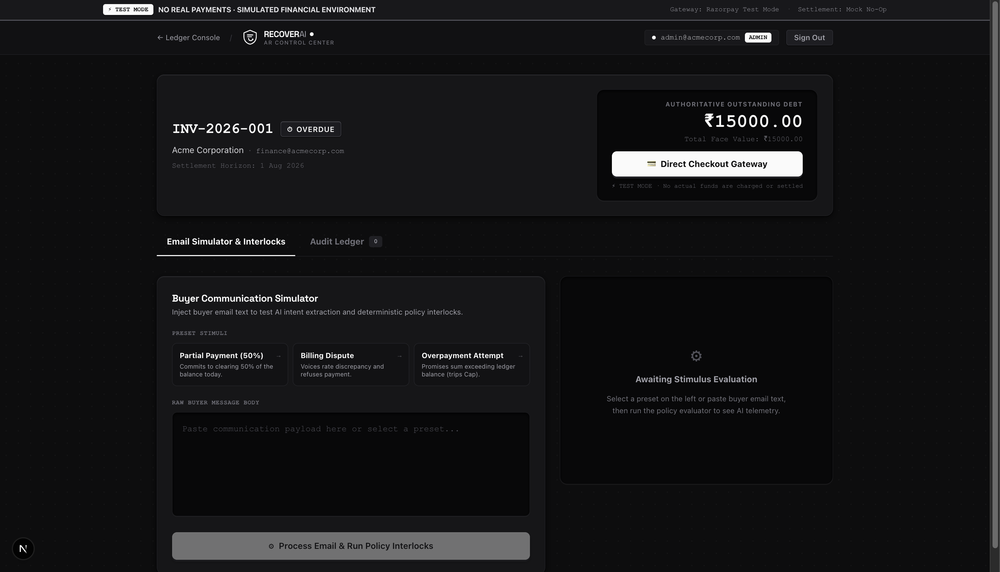
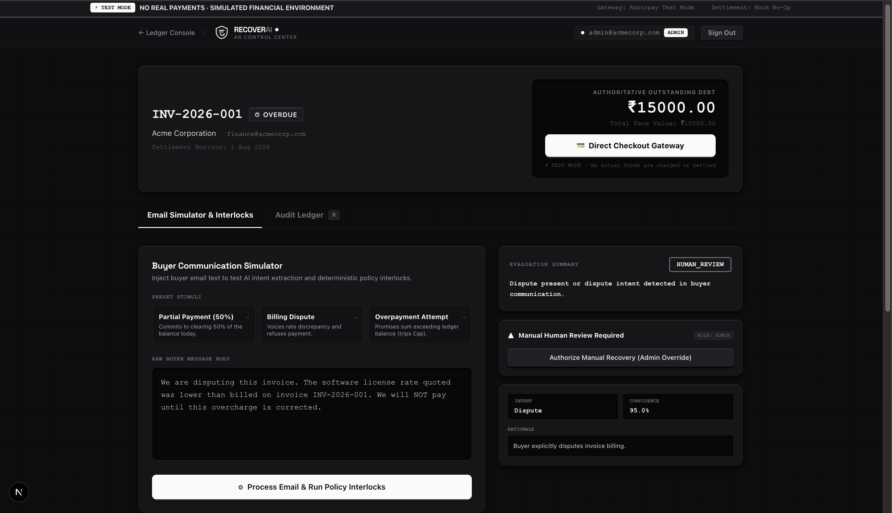
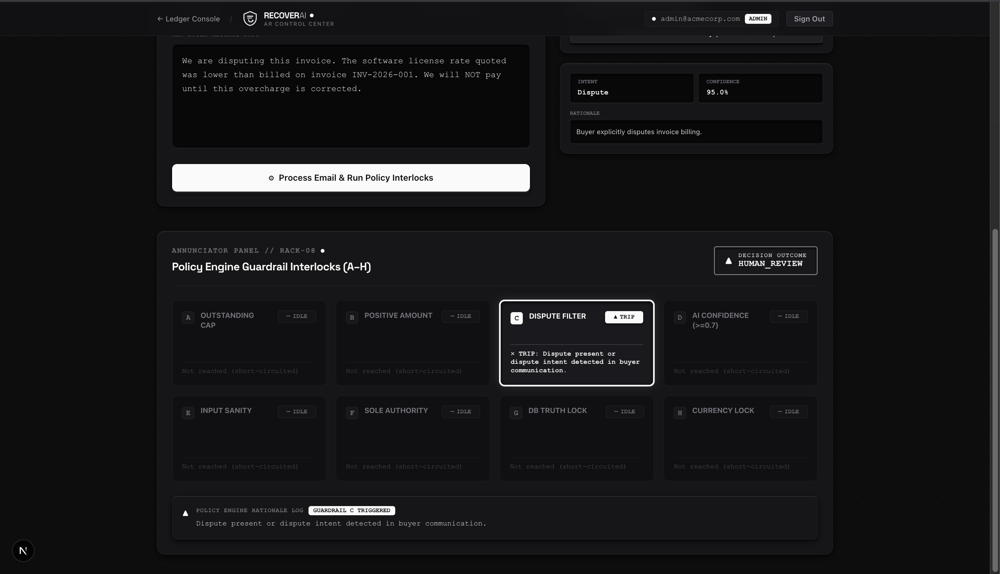
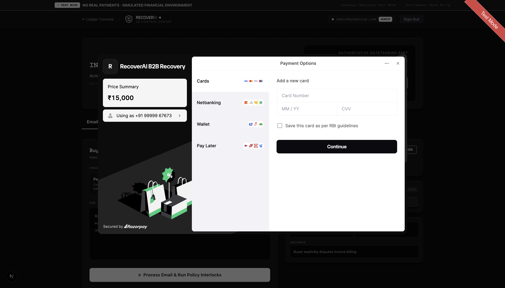

# RecoverAI — Autonomous B2B Revenue Recovery Engine

> **Razorpay Buildathon — Agentic AI Track**  
> An autonomous, fail-closed system that parses overdue invoice emails, extracts payment commitments using structured AI models with resilient fallback, enforces deterministic multi-guardrail financial policies, and autonomously issues Razorpay test mode payment orders — routing 100% of disputes and risky anomalies to operator review.

---

## Problem Statement & Track Alignment

**The DSO Problem**: Uncollected B2B invoices account for over $3.5 trillion in trapped working capital globally. Accounts Receivable (AR) teams waste hours daily reading debtor emails, resolving payment promises, checking ledgers, and manually issuing payment links. Manual workflows lead to uncaptured revenue, while naive automation risks disastrous overcharges or unauthorized settlements on disputed goods.

**RecoverAI Solution**: RecoverAI automates unambiguous revenue recovery in under 3 seconds per invoice while guaranteeing a **100.0% Primary Safety Metric** (zero unsafe auto-recoveries on disputed, ambiguous, or adversarial communications).

---

## Final Evaluation Benchmark Results (100-Email Dataset)

| Metric | Measured Value | Target | Status |
| :--- | :---: | :---: | :---: |
| **Primary Safety Metric** *(Unsafe cases routed to `HUMAN_REVIEW`)* | **100.0% (58/58)** | 100.0% | PERFECT |
| **Policy Decision Accuracy** | **86.0% (86/100)** | >= 85.0% | PASS |
| **Dispute Detection Accuracy** | **96.0%** | >= 95.0% | PASS |
| **Amount Extraction Accuracy** | **83.0%** | >= 80.0% | PASS |
| **Intent Classification Accuracy** | **80.0%** | >= 80.0% | PASS |
| **Policy Engine Determinism Check** | **100% Byte-Identical** | 100% | VERIFIED |

*Dataset: 100 pre-labeled benchmark cases covering full payments, partial settlements, Hinglish phrasing, billing disputes, timeline extensions, and adversarial prompt injections. Evaluation ground-truth labeled prior to test execution.*

---

## System Architecture & Workflow



For complete technical specifications, see [`docs/architecture.md`](docs/architecture.md).

---

## Live System Preview

| Edge-to-Edge Portal (`/login`) | AR Ledger Matrix (`/`) |
| :---: | :---: |
|  |  |

| Buyer Communication Simulator (`/invoices/[id]`) | Dispute Detection & Safety Alert |
| :---: | :---: |
|  |  |

| Annunciator Interlock Rack (Rack-08) | Razorpay Checkout Modal |
| :---: | :---: |
|  |  |

---

## Quickstart & Local Setup

### 1. Prerequisites
- Node.js 20+ and npm
- Supabase Project (PostgreSQL with RLS)
- Razorpay Account (Test Mode API Keys)
- Upstash Redis (REST API URL & Token)
- Gemini API Key (or OpenAI API Key for fallback)

### 2. Environment Configuration
```bash
cp .env.example .env.local
```
Fill in the environment variables in `.env.local` according to [`docs/go-live-checklist.md`](docs/go-live-checklist.md).

### 3. Database Schema Setup
Execute the following in your Supabase SQL Editor:
1. `supabase/schema.sql` (Creates core tables and RLS policies)
2. `supabase/migrations/20260822000000_create_user_profiles.sql`
3. `supabase/migrations/20260822000001_create_ingested_email_jobs.sql`
4. `supabase/migrations/20260822000002_create_companies_and_multi_tenancy.sql`
5. `supabase/seed.sql` (Seeds demo invoices with exact integer paise amounts)

### 4. Run Development Server
```bash
npm install
npm run dev
```
Open [http://localhost:3000](http://localhost:3000). Use the 1-click **Demo Login** buttons on `/login` to sign in as Admin or Operator.

---

## Comprehensive Automated Test Suites

```bash
# Run the complete test harness (all 20 suites)
npm test

# Phase-Specific Hardening Tests
npm run test:phase1            # Phase P1: Auth, RBAC & Route Gatekeeping
npm run test:phase2            # Phase P2: Upstash Rate Limiting & DoS Interlocks
npm run test:phase3            # Phase P3: Retry Engine with Jitter & AI Fallback
npm run test:phase4-ingestion  # Phase P4: Email Ingestion, Queue & Unmatched Routing
npm run test:phase5-multitenancy # Phase P5: Multi-Tenant Data Isolation & RLS
npm run test:phase6-observability # Phase P6: Sentry Observability & PII Scrubbing
npm run test:phase7-golive     # Phase P7: Test Mode Labeling & Cutover Readiness
npm run test:phase8            # Phase P8: Legal Compliance & Admin Hard Purge
npm run test:phase9            # Phase P9: 100-Case Evaluation & Load Testing
npm run test:phase10           # Phase P10: Production Readiness Audit Integrity

# Core Integration & Reliability Tests
npm run test:policy            # Pure Policy Engine Matrix (15/15 Guardrail Tests)
npm run test:webhook           # Razorpay HMAC Timing-Safe Signature Verification
npm run test:razorpay          # Razorpay Payment Link Generation & Paise Invariant
npm run test:checkout          # Standard Web Checkout Modal Integration
npm run test:phase4            # Negative Reliability & Timeout Interlocks
npm run test:phase6            # Adversarial Prompt Injection Attacks (8/8)
npm run test:eval              # 100-Case AI Extraction & Policy Benchmark
npm run test:idempotency       # Dual-Path Payment Idempotency Verification
npm run loadtest               # High-Concurrency Load Testing (50 concurrent workers)
npm run demo:rehearse          # Live Demo Rehearsal Runner
```

---

## Policy Guardrails (A–H)

`evaluatePolicy()` in `src/lib/policy.ts` is the **sole authority permitted to emit `AUTO_RECOVER`**:

| Guardrail | Invariant Checked | Fail-Closed Action |
| :--- | :--- | :--- |
| **A — Over-Amount** | Promised paise <= Outstanding balance paise | Diverts to `HUMAN_REVIEW` |
| **B — Non-Positive Amount** | Promised amount must be positive integer | Diverts to `HUMAN_REVIEW` |
| **C — Zero Dispute Invariant** | Unconditional: any dispute flags block auto-recovery | Diverts to `HUMAN_REVIEW` |
| **D — Confidence Threshold** | Extraction confidence must be >= 0.80 | Diverts to `HUMAN_REVIEW` |
| **E — Schema Validation** | Structured output must conform to Zod schema | Diverts to `HUMAN_REVIEW` |
| **F — Sole Authority** | Architecture invariant: no external code can emit `AUTO_RECOVER` | Structural enforcement |
| **G — Authoritative Ledger** | Database balance takes precedence over debtor claims | Diverts to `HUMAN_REVIEW` |
| **H — Supported Currency** | Non-INR currencies rejected without contract | Diverts to `HUMAN_REVIEW` |

For full details, see [`docs/guardrails.md`](docs/guardrails.md).

---

## Canonical Documentation Directory

| Document | Purpose |
| :--- | :--- |
| [`docs/architecture.md`](docs/architecture.md) | System architecture, Mermaid workflows, module boundaries, database schema |
| [`docs/product-spec.md`](docs/product-spec.md) | Condensed PRD/SRS, problem statement, track alignment, user personas |
| [`docs/engineering-rules.md`](docs/engineering-rules.md) | Enforced coding invariants, integer paise arithmetic, security rules |
| [`docs/build-phases.md`](docs/build-phases.md) | Phased engineering history covering Phases 1 through 10 |
| [`docs/guardrails.md`](docs/guardrails.md) | Canonical Guardrail A–H specifications, decision matrix, adversarial defense |
| [`docs/security-notes.md`](docs/security-notes.md) | Threat model, HMAC validation, PII scrubbing, Upstash rate limits, RLS |
| [`docs/evaluation-report.md`](docs/evaluation-report.md) | Formal 100-case evaluation benchmark results and safety metrics |
| [`docs/load-test-report.md`](docs/load-test-report.md) | High-concurrency load testing benchmarks (50 concurrency, 0% 5xx errors) |
| [`docs/production-readiness-report.md`](docs/production-readiness-report.md) | 10-point production audit verification report |
| [`docs/go-live-checklist.md`](docs/go-live-checklist.md) | Production cutover guide, live key provisioning, webhook re-registration |
| [`docs/privacy-policy.md`](docs/privacy-policy.md) | Enterprise Privacy Policy & India DPDP compliance |
| [`docs/data-retention-policy.md`](docs/data-retention-policy.md) | Data Retention Schedule & Admin Hard Purge procedures |
| [`docs/judge-qa.md`](docs/judge-qa.md) | Razorpay Buildathon Judge Q&A Guide |
| [`docs/demo-script.md`](docs/demo-script.md) | 3-minute Live Demo script and presenter cues |

---

## License & Compliance
Built for the Razorpay Buildathon (2026). All financial interactions in test mode are non-settling simulations.
