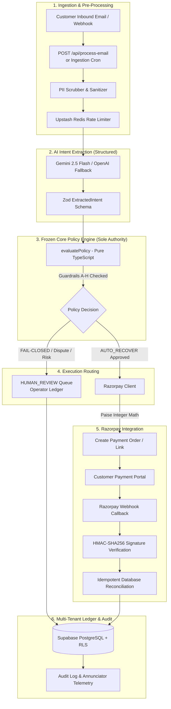
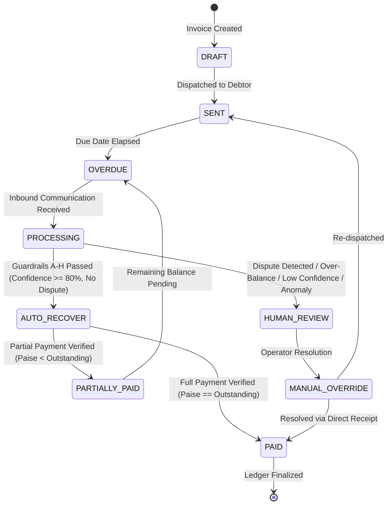

# RecoverAI — Architecture & System Design Specification

## Executive Overview
**RecoverAI** is an autonomous, fail-closed B2B revenue recovery system engineered for the **Razorpay Buildathon (Agentic AI Track)**. It parses incoming customer communications regarding overdue invoices, extracts payment intent, evaluates commitments against deterministic policy guardrails, and autonomously issues Razorpay test mode payment orders while maintaining 100% human-in-the-loop safety for disputes, anomalies, and multi-tenant isolation.

---

## High-Level System Architecture



---

## Module Boundaries & Responsibilities

| Module | Source Path | Core Invariant & Responsibility |
| :--- | :--- | :--- |
| **Policy Engine** | `src/lib/policy.ts` | **Frozen Core Sole Authority**: Pure, deterministic function (`evaluatePolicy()`) that verifies Guardrails A–H. No LLM can trigger financial actions without passing this engine. |
| **AI Extractor** | `src/lib/ai.ts` | **Structured Extraction with Resilient Fallback**: Parses raw text with Gemini 2.5 Flash (`@google/genai`), falling back to OpenAI (`gpt-4o-mini`) on timeout/rate-limit. Validates strictly against `src/lib/ai-schema.ts`. |
| **PII Scrubber** | `src/lib/scrubber.ts` | **Zero Data Leakage**: Sanitizes Aadhaar, PAN, credit cards, bank accounts, and sensitive tokens from error traces and Sentry logs. |
| **Razorpay Client** | `src/lib/razorpay.ts` | **Paise Money Correctness**: All currency handled as integer paise (1 INR = 100 paise). Issues test-mode orders and payment links. |
| **Webhook Handler** | `src/lib/razorpay-webhook.ts` | **Cryptographic Verification**: Validates `X-Razorpay-Signature` via HMAC-SHA256 using timing-safe comparisons before touching database state. |
| **Database & Ledger** | `src/lib/db.ts` | **Authoritative State & Multi-Tenancy**: Scoped database operations with row-level tenant boundaries (`company_id`). |
| **Queue Worker** | `src/lib/queue-worker.ts` | **Async Batch Ingestion**: Background processor for inbound email jobs with exponential backoff and dead-letter handling. |
| **Rate Limiter** | `src/lib/ratelimit.ts` | **Abuse & Denial-of-Service Defense**: Token-bucket sliding window using Upstash Redis with fail-closed in-memory fallback. |
| **Sentry Telemetry** | `src/lib/sentry.ts` | **Scrubbed Observability**: Captures structured operational anomalies and audit breadcrumbs without exposing customer PII. |

---

## End-to-End Workflow & State Machine



---

## Database Architecture & Multi-Tenant Isolation

### 1. Multi-Tenant Schema Isolation
Every invoice, email job, and audit record binds to a `company_id` foreign key. Row-Level Security (RLS) policies enforce that tenant credentials cannot query or mutate cross-organization data:

```sql
-- Multi-Tenancy Invariant
ALTER TABLE invoices ENABLE ROW LEVEL SECURITY;
ALTER TABLE ingested_email_jobs ENABLE ROW LEVEL SECURITY;
ALTER TABLE audit_logs ENABLE ROW LEVEL SECURITY;

CREATE POLICY tenant_isolation_invoices ON invoices
  USING (company_id = auth.jwt() ->> 'company_id');
```

### 2. Money Precision Invariant
- **Column Type**: `BIGINT` (paise) stored alongside human-readable `DECIMAL(10,2)` (INR).
- **Rule**: All calculations, policy comparisons, and Razorpay API payloads evaluate against integer `amount_paise`.

---

## Dual Payment Integration Architecture

RecoverAI supports two standard Razorpay collection flows:
1. **Razorpay Standard Checkout (Modal)**: Embedded client-side integration via `RazorpayCheckoutButton.tsx` and `/api/razorpay/create-order` + `/api/razorpay/verify-payment`.
2. **Razorpay Payment Links (Direct URL)**: Asynchronous payment dispatch via `createTestPaymentLink()` for automated email dispatch workflows.

Both flows funnel through idempotent webhook and verification handlers to ensure zero double-crediting.
